# job-micro-service
Spring Boot based Microservice for Job (Backend) Application.

## Architecture Diagram (High level flow) :

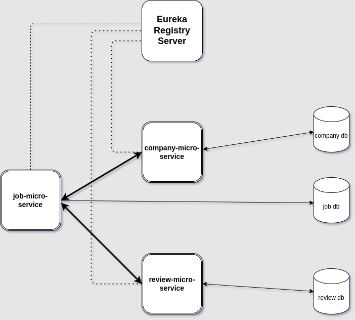

---

## Microservices Notes :

### Principles of Microservices :

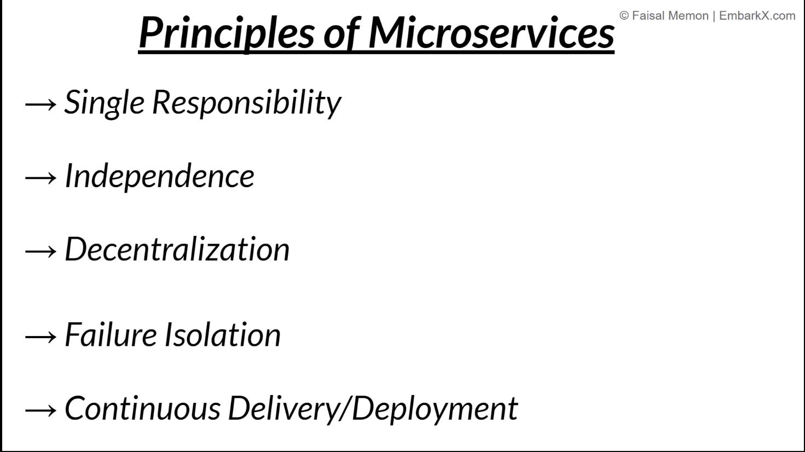

### Benefits of Service Registry :

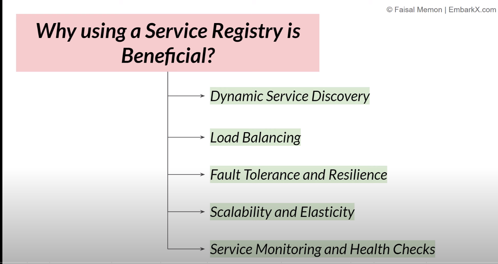

### OpenFeign (Declarative REST Client) :

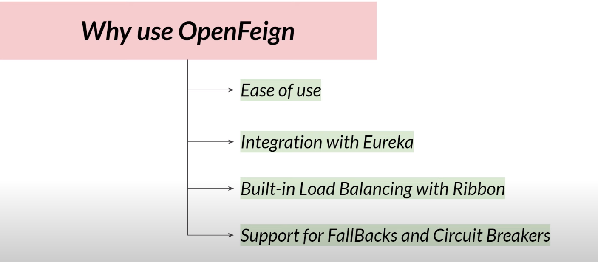

### Ditributed Tracing Systems (Role in Microservices) :

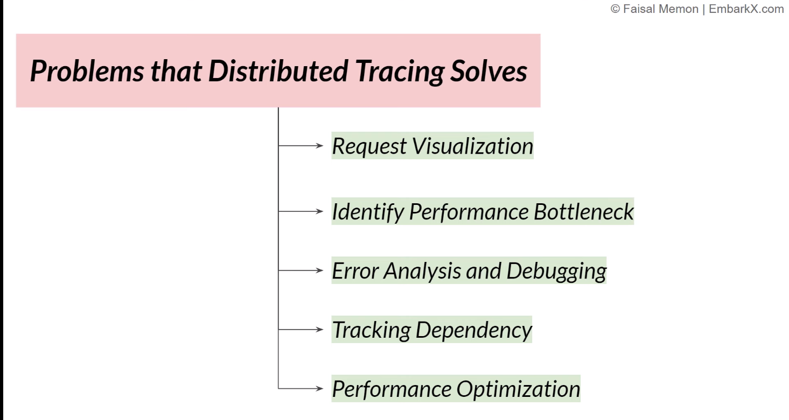

### Zipkin (Ditributed Tracing System) :

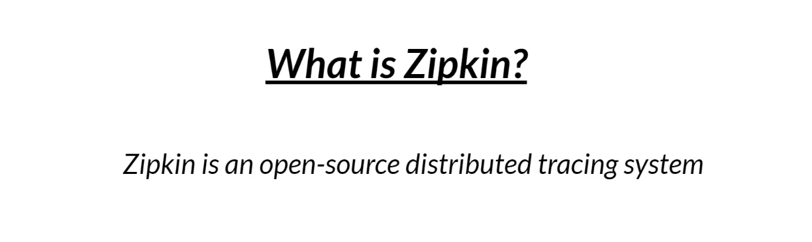

#### How Zipkin will Work (basic view)

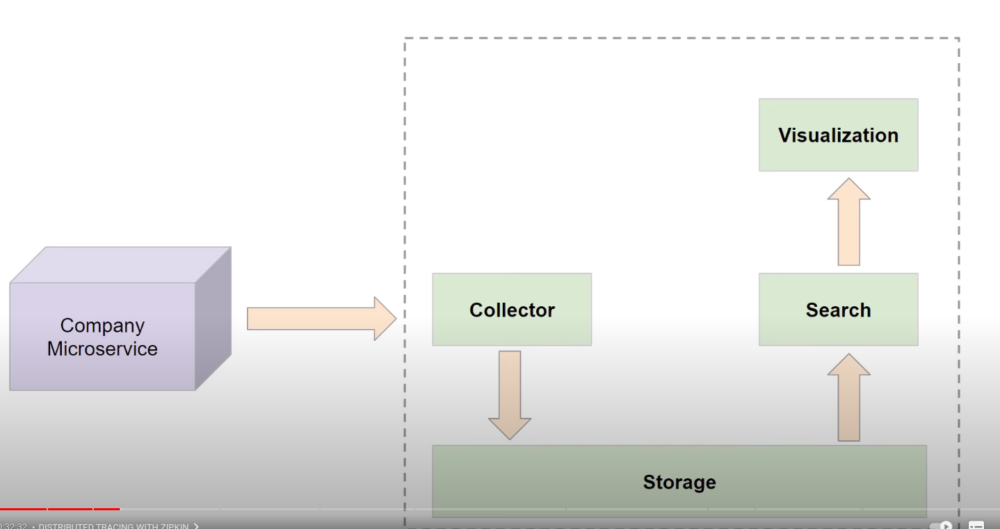

#### Trace ID vs Span IDs :

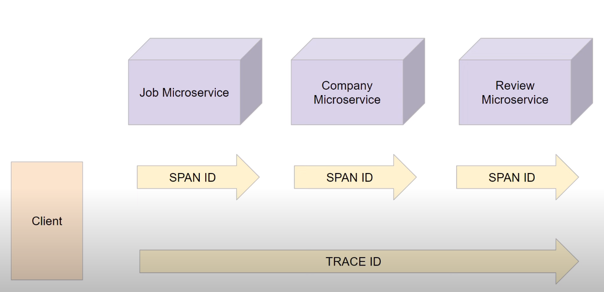

#### Zipkin Official Page:

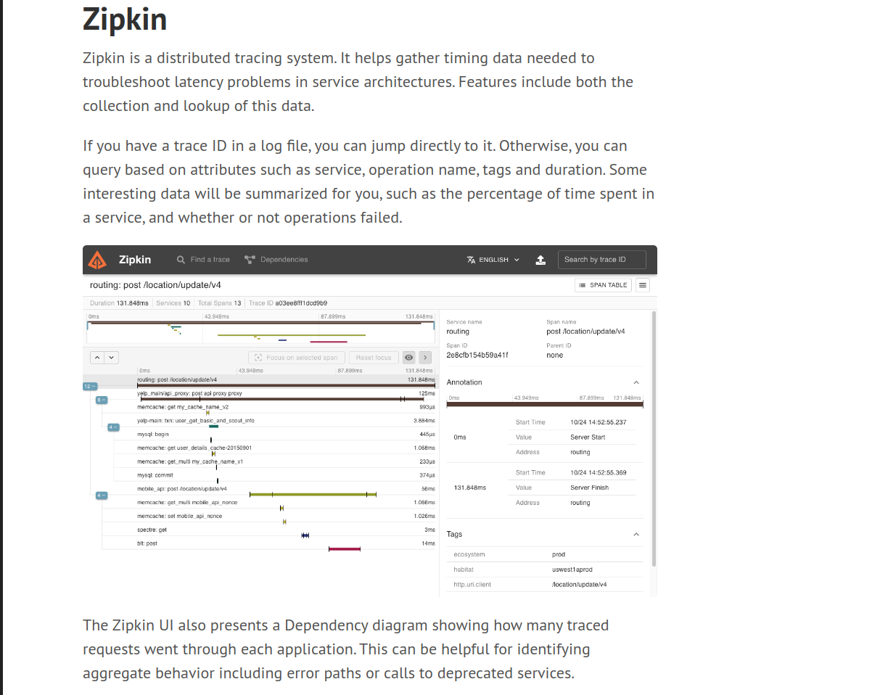

### Micrometer :

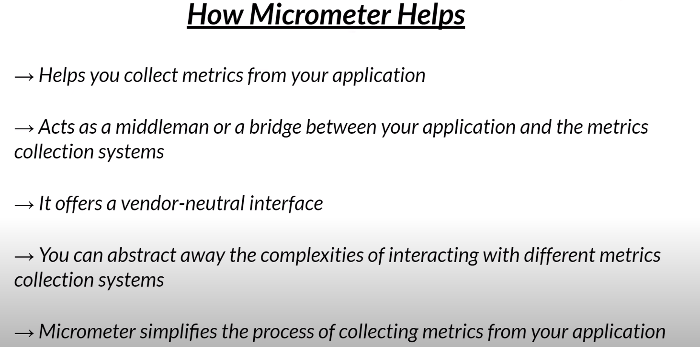

### Zipkin & Micrometer Dependency :

---

### What is :

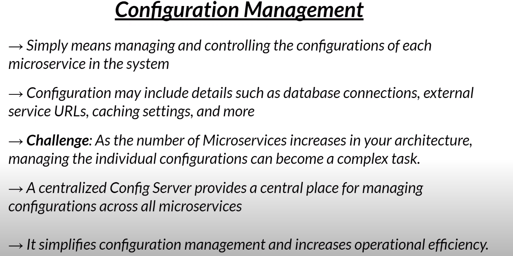

#### Features : 

#### Benefits :

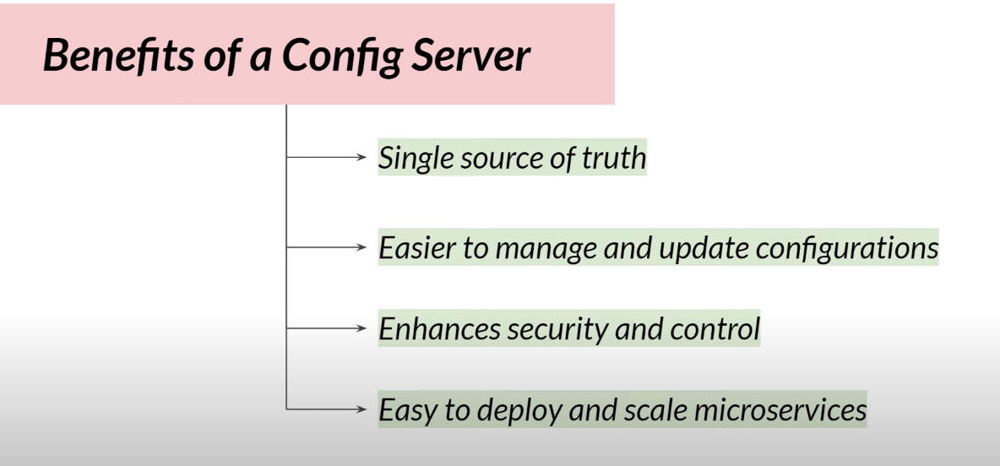

---

### Spring Cloud Config Server :

#### Features :

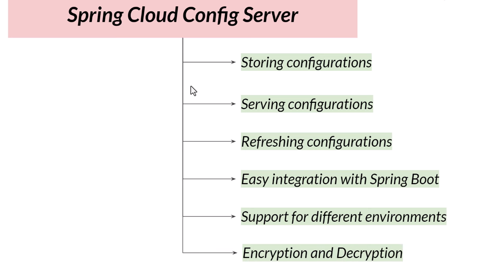

#### Working of Spring Config Server :

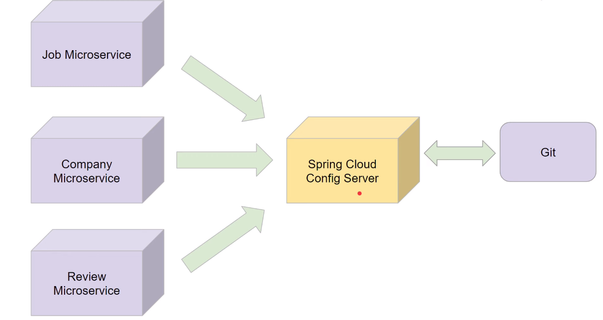

----

## API Gateway :

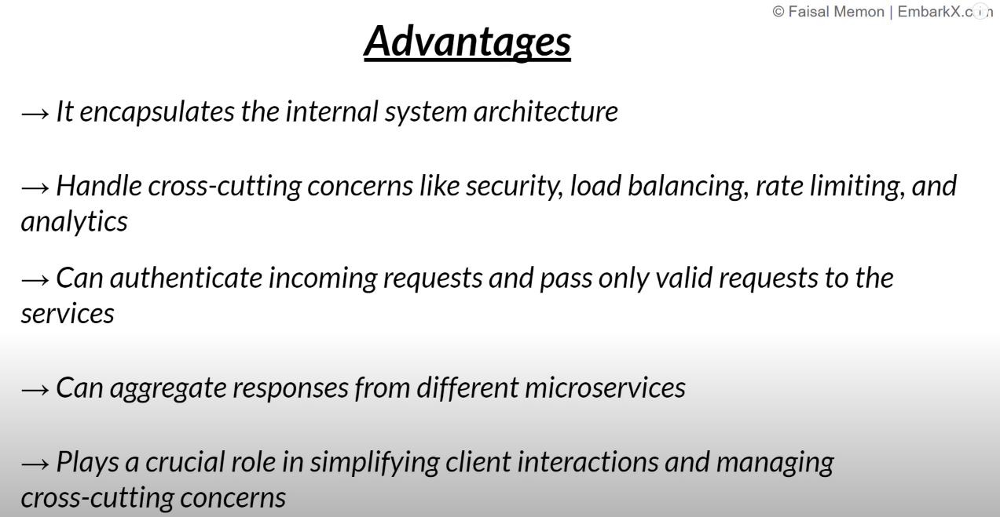

#### Features :

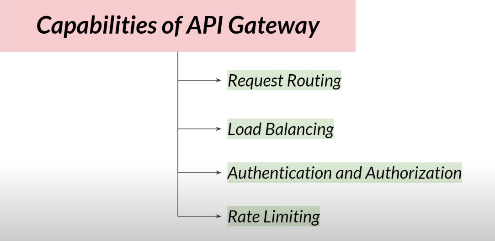

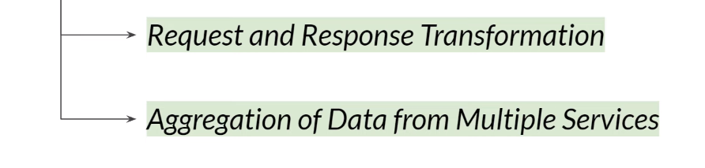

### Job Service Architecture with API Gateway :

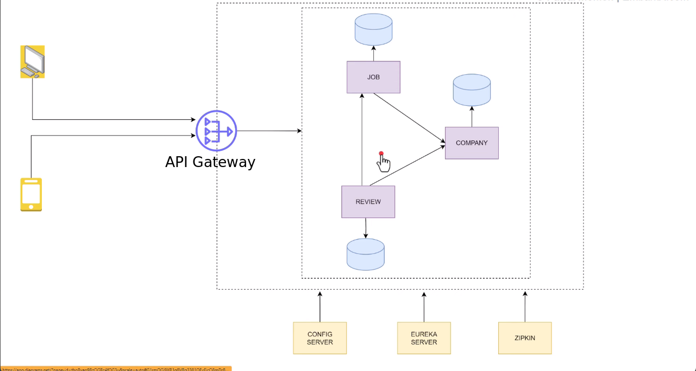