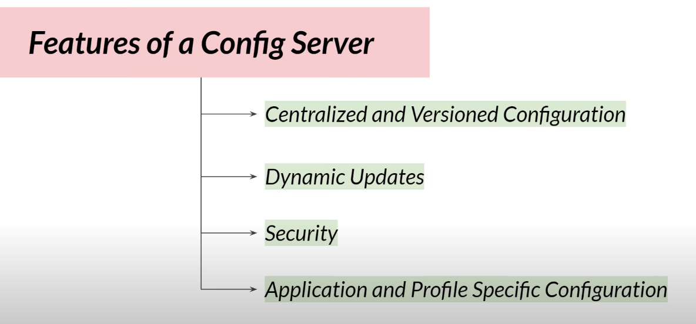

# job-micro-service
Spring Boot based Microservice for Job (Backend) Application.

## Architecture Diagram (High level flow) :

---

## Microservices Notes :

### Principles of Microservices :

### Benefits of Service Registry :

### OpenFeign (Declarative REST Client) :

### Ditributed Tracing Systems (Role in Microservices) :

### Zipkin (Ditributed Tracing System) :

#### How Zipkin will Work (basic view)

#### Trace ID vs Span IDs :

#### Zipkin Official Page:

### Micrometer :

### Zipkin & Micrometer Dependency :

---

### What is :

#### Features : 

#### Benefits :

---

### Spring Cloud Config Server :

#### Features :

#### Working of Spring Config Server :

----

## API Gateway :

#### Features :

### Job Service Architecture with API Gateway :

